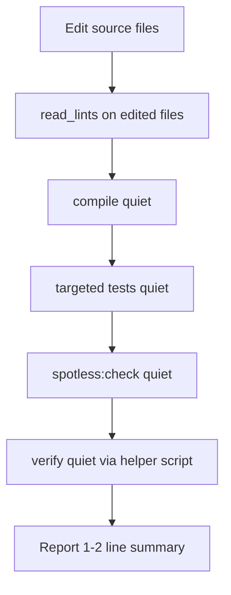

# Agent Verification Rules

## Problem

The agent edits code but rarely runs checks afterward. You want tiered verification (targeted first, broader before finishing) **without** blowing up chat token usage as the test suite grows.

## What verification is available today

| Mechanism | Command | Needs DB/.env? | Token risk |
|-----------|---------|----------------|------------|
| IDE diagnostics | `read_lints` on edited files | No | Low |
| Compile | `./mvnw -q -B -DskipTests compile` | No | Low |
| Targeted tests | `./mvnw -q -B test -Dtest=UserServiceTests` | No (H2) | Low–medium |
| Spotless | `./mvnw -q -B spotless:check` | No | Low |
| Full suite | `./mvnw -q -B test` | No | Medium (grows with tests) |
| Full gate | `./mvnw -q -B verify` | No | Medium (tests + spotless) |
| Context smoke | `DbBackendApplicationTests` | No | Low (1 test) |
| Manual HTTP smoke | `api-testing/*.http` via running server | Yes (`.env` + PostgreSQL) | N/A — not for agent automation |

**Not available yet** (out of scope for rules-only pass): GitHub Actions CI, pre-commit hooks, Testcontainers repository tests, dedicated `{Entity}MapperTests`.

Current test inventory is small ([`UserControllerTests`](src/test/java/com/lokeswarandk/db_backend/controller/UserControllerTests.java), [`UserServiceTests`](src/test/java/com/lokeswarandk/db_backend/service/UserServiceTests.java), [`DbBackendApplicationTests`](src/test/java/com/lokeswarandk/db_backend/DbBackendApplicationTests.java)) but will grow as more resources are added per [`project-overview.mdc`](.cursor/rules/project-overview.mdc).

---

## Recommended tiered workflow (token-conscious)



### Tier 0 — always, zero terminal output
- Run `read_lints` on every file you edited; fix issues before proceeding.

### Tier 1 — after any Java edit (fast, quiet)
- `./mvnw -q -B -DskipTests compile` — catches type/syntax errors in ~seconds.
- **Chat rule:** report only `compile: OK` or paste the error block (usually small).

### Tier 2 — targeted tests (default after logic changes)
Map edited production files to the smallest useful test set:

| You edited | Run |
|------------|-----|
| `controller/{Entity}Controller.java` | `-Dtest={Entity}ControllerTests` |
| `service/{Entity}Service.java` | `-Dtest={Entity}ServiceTests` |
| `mapper/{Entity}Mapper.java` | `-Dtest={Entity}ServiceTests` (mapper covered indirectly today) |
| `dto/**/{Entity}*` | `-Dtest={Entity}ControllerTests,{Entity}ServiceTests` |
| `repository/{Entity}Repository.java` | `-Dtest={Entity}ServiceTests` |
| `model/{Entity}.java` | service tests for consumers; if unsure, entity's service tests |
| `exception/GlobalExceptionHandler.java`, `common/ApiResponseBuilder.java` | all `*ControllerTests` + `DbBackendApplicationTests` |
| `pom.xml`, `application.yml`, `DbBackendApplication.java` | skip targeted → go to Tier 3 |

Command pattern:
```bash
./mvnw -q -B test -Dtest=UserServiceTests
```

**Chat rule:** on success, one line — e.g. `UserServiceTests: passed`. Do **not** paste Surefire stdout.

### Tier 3 — before marking task complete
- Run full gate via a helper script (see below) — not raw `./mvnw verify` piped into chat.
- **Chat rule:** report the script's one-line summary only; if it fails, paste **only** the extracted failure section.

### Spotless
- After Java edits: `./mvnw -q -B spotless:check`.
- If it fails: `./mvnw spotless:apply` on affected files, then re-check.
- Can be folded into `verify` at Tier 3; run explicitly at Tier 2 only when you edited formatting-sensitive files without running verify yet.

### What NOT to automate in rules
- `api-testing/*.http` / `scripts/run-local.sh` — requires live PostgreSQL and `.env`; keep as human manual smoke, mention in rule as optional post-merge check.
- Running the full test log into chat on every turn.

---

## Token-efficiency tactics (encode in the rule)

1. **Always pass `-q -B`** to Maven (quiet + batch/CI mode) — dramatically less noise than default Surefire output.
2. **Targeted `-Dtest=`** over full suite whenever the change scope is narrow.
3. **Success = no log dump** — agent states pass/fail counts in one sentence.
4. **Failure = excerpt only** — grep for `FAILURE`, `ERROR`, `Tests run:`, failed test name; never paste the entire build log.
5. **Helper script** centralizes this so the agent doesn't improvise fragile `tail | grep` pipelines.

### Proposed helper: [`scripts/check.sh`](scripts/check.sh)

```bash
# Usage:
#   ./scripts/check.sh compile
#   ./scripts/check.sh test UserServiceTests
#   ./scripts/check.sh test UserControllerTests,UserServiceTests
#   ./scripts/check.sh verify          # full gate before task complete

# Behavior:
# - Runs ./mvnw -q -B with the right goal
# - On success: prints one line (e.g. "verify: BUILD SUCCESS, 24 tests, 0 failures")
# - On failure: prints only failure summary lines (BUILD FAILURE + failed test names)
# - Exit code mirrors Maven
```

This keeps terminal output bounded regardless of how many tests exist.

---

## New and updated Cursor rules

### 1. NEW: [`verification-workflow.mdc`](.cursor/rules/verification-workflow.mdc) — `alwaysApply: true`

Core content (~40 lines):

- **When to verify:** after editing any `src/main/java`, `src/test/java`, `pom.xml`, or `application.yml` file.
- **Tier 0–3 workflow** (summary from above).
- **File → test mapping table** (compact version).
- **Token budget rules:** `-q -B`, use `scripts/check.sh`, success = one-line report, failure = excerpt only.
- **Fix loop:** if a check fails, fix and re-run the **same** check before broadening scope.
- **New resource checklist:** when adding `{Entity}` module, run both `{Entity}ControllerTests` and `{Entity}ServiceTests` before `verify`.

### 2. UPDATE: [`testing.mdc`](.cursor/rules/testing.mdc)

Add a **"Verification commands"** section:
- Reference `scripts/check.sh` as the preferred entry point.
- Document `-Dtest=` examples for this project's naming convention.
- Note: prefer targeted `check.sh test` runs over full suite when change scope is narrow.

### 3. UPDATE: [`project-overview.mdc`](.cursor/rules/project-overview.mdc)

One bullet under Conventions:
- "After code changes, follow `verification-workflow` — run `scripts/check.sh` before finishing."

### 4. UPDATE: [`java-formatting.mdc`](.cursor/rules/java-formatting.mdc)

Add:
- Spotless check is part of verification (not only pre-commit).
- Prefer `spotless:apply` + `spotless:check` when formatting fails; don't hand-fix style.

**No changes** to entity/DTO/error-handling rules — verification is cross-cutting.

---

## Optional future enhancements (not in this pass)

These further reduce risk but are separate from Cursor rules:

| Enhancement | Benefit |
|-------------|---------|
| GitHub Actions `mvnw verify` on PR | Catches what the agent misses; zero chat tokens |
| Pre-commit hook (`spotless:check` + targeted tests) | Local safety net |
| `{Entity}MapperTests` | Faster feedback when mapper logic grows |
| Testcontainers for repositories | PG-accurate SQL without manual smoke |

---

## Example agent behavior after rules land

**Scenario:** agent edits [`UserMapper.java`](src/main/java/com/lokeswarandk/db_backend/mapper/UserMapper.java)

1. `read_lints` on `UserMapper.java` → clean
2. `./scripts/check.sh compile` → `compile: OK`
3. `./scripts/check.sh test UserServiceTests` → `test: 8 passed, 0 failed`
4. Before done: `./scripts/check.sh verify` → `verify: BUILD SUCCESS, 24 tests, 0 failures`
5. Chat message: *"Updated UserMapper field mapping. UserServiceTests and full verify passed."* — no Maven log pasted.

**Scenario:** verify fails

1. Script prints: `FAILED: UserServiceTests.update_appliesFields — expected X got Y`
2. Agent fixes, re-runs `./scripts/check.sh test UserServiceTests` only (not full verify yet).
3. Re-runs `./scripts/check.sh verify` once targeted test passes.
