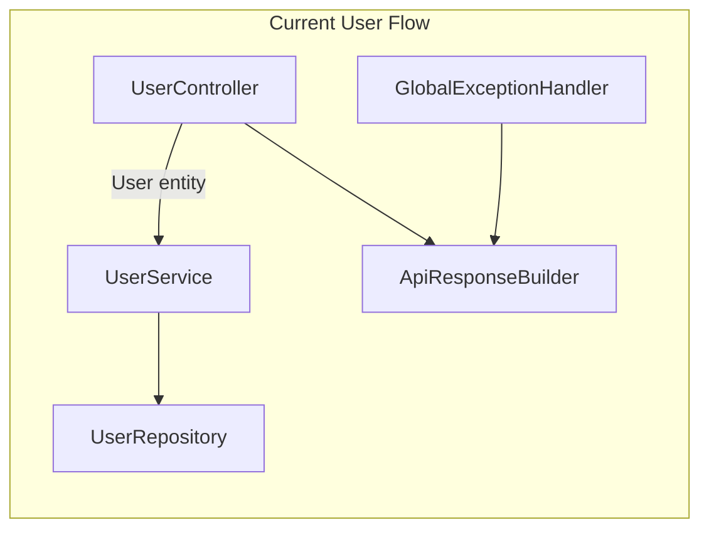
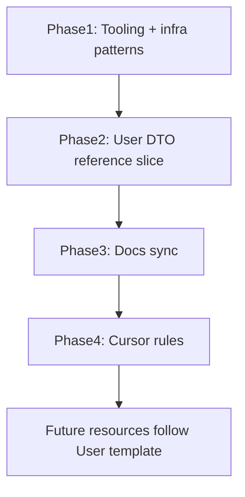
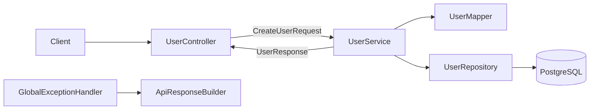

# Convention Standardization and Cursor Rules

## Current State

**Stack:** Java 17, Spring Boot 4.0.6, Spring Data JDBC, PostgreSQL, layered monolith.

Only the **User** vertical slice is fully wired (`controller` → `service` → `repository`). Six domain models in [`model/`](src/main/java/com/lokeswarandk/db_backend/model/) exist without APIs. Conventions are documented in [`docs/conventions.md`](docs/conventions.md) and related docs, but **nothing enforces them** — no `.cursor/rules/`, no Spotless, no `.editorconfig`.



---

## Dominant Patterns to Keep (Baseline)

These are consistent across the codebase and align with Spring Boot best practices. They become **non-negotiable** in rules:

| Area | Pattern | Evidence |
|------|---------|----------|
| Architecture | Controller → Service → Repository layered monolith | [`UserController`](src/main/java/com/lokeswarandk/db_backend/controller/UserController.java), [`UserService`](src/main/java/com/lokeswarandk/db_backend/service/UserService.java), [`UserRepository`](src/main/java/com/lokeswarandk/db_backend/repository/UserRepository.java) |
| DI | Constructor injection only | All Spring components |
| Persistence | Spring Data JDBC (`CrudRepository`, `@Table`, `@Query` text blocks) | [`UserRepository`](src/main/java/com/lokeswarandk/db_backend/repository/UserRepository.java) |
| FK modeling | `AggregateReference<Entity, Long>` on related entities | [`Receipt`](src/main/java/com/lokeswarandk/db_backend/model/Receipt.java) |
| Utilities | `final` class, private constructor, static methods | [`ApiResponseBuilder`](src/main/java/com/lokeswarandk/db_backend/common/ApiResponseBuilder.java), [`StringUtils`](src/main/java/com/lokeswarandk/db_backend/common/StringUtils.java) |
| Errors | `@RestControllerAdvice` + `ApiResponseBuilder` envelopes | [`GlobalExceptionHandler`](src/main/java/com/lokeswarandk/db_backend/exception/GlobalExceptionHandler.java) |
| Naming | `{Entity}Controller/Service/Repository`, camelCase fields, `UPPER_SNAKE_CASE` constants | [`docs/conventions.md`](docs/conventions.md) |
| API paths | `/api/{resource-plural}` with action sub-paths | `/api/users`, `/api/users/search/mobile` |
| Manual API tests | `api-testing/{resource}.http` per resource | [`api-testing/user.http`](api-testing/user.http) |
| Tests | `*Tests.java` under mirrored package | [`DbBackendApplicationTests`](src/test/java/com/lokeswarandk/db_backend/DbBackendApplicationTests.java) |
| Services | Concrete `@Service` classes (no interfaces until multiple impls needed) | Early-stage monolith convention |

**Intentionally not adopting yet:** MapStruct, Lombok, Flyway/Liquibase, Spring Security, CI — documented gaps, out of scope for this pass.

---

## Pattern Review: Gaps and Improvements

### 1. API boundary — introduce DTOs (confirmed)

**Problem:** Controllers accept/return persistence entities. This couples HTTP to DB schema, leaks `id`/`createdAt` on create, and makes `AggregateReference` awkward in JSON for upcoming Receipt/Transaction APIs.

**Target structure:**

```text
dto/
  request/
    CreateUserRequest.java
    UpdateUserRequest.java
  response/
    UserResponse.java
    MobilePrefixSearchResponse.java
mapper/
  UserMapper.java
```

**Rules:**
- Request DTOs carry Jakarta validation (`@NotBlank`, etc.)
- Response DTOs expose only client-facing fields
- FK fields in DTOs: plain `Long` ids; service converts to `AggregateReference`
- Controllers keep `ResponseEntity<Object>` return type (existing convention)
- Manual mapping in stateless `{Entity}Mapper` classes — no MapStruct yet

### 2. Validation placement — unify

**Current inconsistency:** [`UserController.listUsers`](src/main/java/com/lokeswarandk/db_backend/controller/UserController.java) checks `mobile` blank-ness in controller; `searchMobileByPrefix` delegates to service.

**Fix:**
- Move Bean Validation **off entities** and **onto request DTOs**
- Controllers pass query params through; service validates via `StringUtils.requireNonBlank()` + `IllegalArgumentException`
- Remove controller-level `mobile` blank check

### 3. 404 handling — `ResourceNotFoundException`

**Current:** Every controller method repeats `Optional` → `ApiResponseBuilder.error(NOT_FOUND, ...)`.

**Fix:** Add [`exception/ResourceNotFoundException.java`](src/main/java/com/lokeswarandk/db_backend/exception/ResourceNotFoundException.java); register in `GlobalExceptionHandler` → 404 envelope. Services throw it for missing ids on find/update/delete; controllers become thin.

### 4. Success response shapes — document rules

| Case | Shape |
|------|-------|
| Create / Read / Update | Response DTO (or list) |
| Delete | `ApiResponseBuilder.messagePayload(...)` map |
| Search projections | Dedicated response DTO (e.g. `MobilePrefixSearchResponse`) |

Errors always use `ApiResponseBuilder` envelope (`timestamp`, `status`, `error`, `message`/`details`).

### 5. Logging and safe 500 responses

**Current:** No application logging; [`GlobalExceptionHandler`](src/main/java/com/lokeswarandk/db_backend/exception/GlobalExceptionHandler.java) returns `ex.getMessage()` to clients.

**Fix:**
- Add SLF4J `Logger` in `GlobalExceptionHandler`
- Log full stack trace at ERROR for uncaught `Exception`
- Return generic `"An unexpected error occurred"` to client (Spring Boot security best practice)

### 6. Formatting enforcement

**Current inconsistency:** [`DbBackendApplication.java`](src/main/java/com/lokeswarandk/db_backend/DbBackendApplication.java) and test class use **tabs**; other Java uses **4 spaces**. No formatter in [`pom.xml`](pom.xml).

**Add:**
- [`.editorconfig`](.editorconfig) — `indent_size = 4`, `indent_style = space`, `charset = utf-8`, `end_of_line = lf`
- **Spotless Maven plugin** in `pom.xml` with Google Java Format (Spring ecosystem default)
- Run `./mvnw spotless:apply` to normalize all 17 Java files

### 7. Entity conventions — persistence-only

After DTO introduction:
- Entities keep `@Table`, `@Id`, no-arg ctor with materialization comment, manual getters/setters
- `@Nullable LocalDateTime createdAt` on entities that have timestamp columns
- Remove Jakarta validation from entities (validation lives on request DTOs only)
- Audit [`PaymentMode`](src/main/java/com/lokeswarandk/db_backend/model/PaymentMode.java) for `createdAt` consistency

### 8. Testing minimum bar per resource

| Layer | Test type | Convention |
|-------|-----------|------------|
| Controller | `@WebMvcTest` + MockMvc | `{Entity}ControllerTests.java` |
| Service | Unit test with mocked repository | `{Entity}ServiceTests.java` |
| Smoke | Context load | Keep `DbBackendApplicationTests` |
| Manual | REST Client file | `api-testing/{resource}.http` with happy + error paths |

Add missing **PUT** example to [`api-testing/user.http`](api-testing/user.http) during User refactor.

---

## Codebase Alignment Plan

Execute in order — each phase becomes the template for Event, Receipt, Transaction, etc.



### Phase 1 — Tooling and shared infrastructure

- Add `.editorconfig` and Spotless to [`pom.xml`](pom.xml)
- Run `./mvnw spotless:apply`
- Add `ResourceNotFoundException` + handler registration
- Fix `GlobalExceptionHandler` logging and safe 500 messages

### Phase 2 — User reference implementation

- Create `dto/request/`, `dto/response/`, `mapper/UserMapper.java`
- Refactor [`UserController`](src/main/java/com/lokeswarandk/db_backend/controller/UserController.java) and [`UserService`](src/main/java/com/lokeswarandk/db_backend/service/UserService.java) to DTOs
- Move validation from [`User`](src/main/java/com/lokeswarandk/db_backend/model/User.java) entity to request DTOs
- Update [`api-testing/user.http`](api-testing/user.http) (add PUT, adjust JSON shapes)
- Add `UserControllerTests` and `UserServiceTests`

### Phase 3 — Documentation sync

Update to match refactored code:
- [`docs/conventions.md`](docs/conventions.md) — DTO package, mapper, validation-on-DTO rule
- [`docs/architecture.md`](docs/architecture.md) — revised request flow diagram
- [`docs/error-handling.md`](docs/error-handling.md) — `ResourceNotFoundException`, logging policy
- [`docs/structure.md`](docs/structure.md) — `dto/`, `mapper/` placement
- [`docs/api-reference.md`](docs/api-reference.md) — new User request/response shapes

### Phase 4 — Cursor rules (7 focused `.mdc` files)

Create [`.cursor/rules/`](.cursor/rules/) per [create-rule skill](file:///home/lokeswarandk/.cursor/skills-cursor/create-rule/SKILL.md) — concise, one concern each, with good/bad examples from refactored User module:

| File | Scope | Purpose |
|------|-------|---------|
| `project-overview.mdc` | `alwaysApply: true` | Stack, layered architecture, package map, where to add code |
| `java-formatting.mdc` | `globs: **/*.{java,xml,yml}` | 4-space indent, Spotless, no tabs |
| `api-dto-patterns.mdc` | `globs: **/controller/**,**/dto/**,**/mapper/**` | DTO naming, mapping, `ResponseEntity<Object>`, path conventions |
| `service-repository.mdc` | `globs: **/service/**,**/repository/**` | Service orchestration, queries, `AggregateReference`, `ResourceNotFoundException` |
| `error-handling.mdc` | `globs: **/exception/**,**/common/ApiResponseBuilder.java` | Envelope shapes, handler registration, no raw exception messages |
| `entity-model.mdc` | `globs: **/model/**` | `@Table`, `@Id`, persistence-only (no API validation) |
| `testing.mdc` | `globs: **/*Tests.java,api-testing/**` | Test naming, `@WebMvcTest` pattern, `.http` file conventions |

**Example rule snippet** (`api-dto-patterns.mdc`):

```java
// GOOD — controller uses DTOs, not entities
@PostMapping
public ResponseEntity<Object> addUser(@Valid @RequestBody CreateUserRequest request) {
    return ResponseEntity.status(CREATED).body(userService.create(request));
}

// BAD — exposing persistence entity at API boundary
@PostMapping
public ResponseEntity<Object> addUser(@Valid @RequestBody User user) { ... }
```

### Phase 5 — Future resources checklist

Each new resource (Event, Receipt, Transaction, etc.) follows the User template:

1. Entity in `model/` (persistence only)
2. `{Entity}Repository` extending `CrudRepository`
3. Request/response DTOs in `dto/`
4. `{Entity}Mapper` in `mapper/`
5. `{Entity}Service` + `{Entity}Controller`
6. `api-testing/{entity}.http`
7. `{Entity}ControllerTests` + `{Entity}ServiceTests`

---

## Target Architecture (After Refactor)



---

## Success Criteria

- `./mvnw spotless:check` passes on all Java sources
- User API uses DTOs end-to-end; `api-testing/user.http` matches
- `ResourceNotFoundException` replaces inline 404 handling in UserController
- Seven focused Cursor rules exist under `.cursor/rules/`
- `docs/conventions.md` reflects DTO + validation + error patterns
- Adding a new resource has a clear, repeatable checklist (rules + docs)
