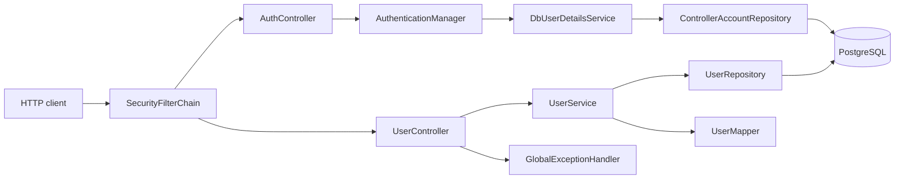

# Donation Management Backend

REST API service for the [Donation Management](https://github.com/DKLokeswaran/db-frontend) platform — a system built primarily to help temples track devotees (users) and donations, with a domain model that extends naturally to events, offerings, receipts, and transactions.

**Companion frontend:** [DKLokeswaran/db-frontend](https://github.com/DKLokeswaran/db-frontend)

---

## Table of Contents

- [About](#about)
- [Features](#features)
- [Tech Stack](#tech-stack)
- [Prerequisites](#prerequisites)
- [Getting Started](#getting-started)
- [Configuration](#configuration)
- [Usage](#usage)
- [API Overview](#api-overview)
- [Architecture](#architecture)
- [Project Structure](#project-structure)
- [Development](#development)
- [Testing](#testing)
- [Build](#build)
- [Deployment](#deployment)
- [Documentation](#documentation)
- [Roadmap](#roadmap)
- [Contributing](#contributing)
- [Code of Conduct](#code-of-conduct)
- [Security](#security)
- [License](#license)
- [Acknowledgments](#acknowledgments)
- [Authors](#authors)
- [Support](#support)

---

## About

Donation Management Backend is a Spring Boot service that exposes HTTP APIs for managing user records and lays the groundwork for donation workflows, secured behind session-based staff authentication. It is designed for temple administrators who need a reliable way to log in, register devotees, look them up by mobile number, and (as the platform grows) record offerings, receipts, and payment transactions.

The codebase follows a layered monolith pattern and is intentionally small and readable so it can be adapted to adjacent use cases — community centers, cultural organizations, or any group that needs structured donor and contribution tracking.

---

## Features

- **Session authentication** — Staff/controller login via `POST /api/auth/login`, session-cookie-backed access, `POST /api/auth/logout`, and `GET /api/auth/me`, with BCrypt-hashed passwords and role-based authorities.
- **User management** — Create, read, update, and delete user records with validated request bodies (requires an authenticated session).
- **Mobile lookup** — List users by exact mobile number or search distinct mobile prefixes for typeahead UIs.
- **Consistent API responses** — Standard success payloads and centralized error handling via `GlobalExceptionHandler`, including authentication failures.
- **Domain model for donations** — Entities for events, offering types, payment modes, receipts, transactions, and transaction items (persistence layer in place; REST endpoints expand over time).
- **PostgreSQL persistence** — Production datasource via environment variables; H2 in-memory database for tests.
- **Developer tooling** — Maven Wrapper, Spotless formatting, HTTP request samples under `api-testing/`.

---

## Tech Stack

| Layer | Technology |
| --- | --- |
| Runtime | Java 17 |
| Framework | Spring Boot 4.0.6 |
| Web | Spring Web (REST) |
| Security | Spring Security (session-cookie auth, BCrypt) |
| Persistence | Spring Data JDBC |
| Database | PostgreSQL (runtime), H2 (tests) |
| Validation | Jakarta Bean Validation |
| Build | Maven (wrapper included) |
| Formatting | Spotless (Google Java Format, AOSP) |

---

## Prerequisites

- **JDK 17** or newer
- **PostgreSQL** database reachable from your machine
- **Git**
- (Optional) [Donation Management Frontend](https://github.com/DKLokeswaran/db-frontend) for the full UI experience

---

## Getting Started

### 1. Clone the repository

```bash
git clone https://github.com/DKLokeswaran/db-backend.git
cd db-backend
```

### 2. Create a local environment file

Create a `.env` file in the project root (this file is gitignored and must not be committed):

```bash
DB_DATASOURCE_URL=jdbc:postgresql://localhost:5432/donation_management
DB_DATASOURCE_USERNAME=your_username
DB_DATASOURCE_PASSWORD=your_password
```

Ensure the PostgreSQL database exists and that Spring Data JDBC can create or access the required tables for your schema. Schema management (table creation) is not handled by this repository — the `controllers` table (backing `ControllerAccount`) must already exist with at least one BCrypt-hashed staff login before you can authenticate against the API.

### 3. Start the server

```bash
./scripts/run-local.sh
```

The API listens on **port 8084** by default.

Alternatively, export the variables manually and run Maven:

```bash
export DB_DATASOURCE_URL=...
export DB_DATASOURCE_USERNAME=...
export DB_DATASOURCE_PASSWORD=...
./mvnw spring-boot:run
```

### 4. Verify

Run the test suite:

```bash
./mvnw test
```

Log in first, then try a sample request (with the server running). Every `/api/users` endpoint requires an authenticated session, so save the session cookie from login and reuse it:

```bash
curl -c cookies.txt -X POST http://localhost:8084/api/auth/login \
  -H "Content-Type: application/json" \
  -d '{"username": "your_username", "password": "your_password"}'

curl -b cookies.txt http://localhost:8084/api/users
```

See `api-testing/auth.http` and `api-testing/user.http` for more examples compatible with REST Client extensions.

---

## Configuration

| Variable | Required | Description |
| --- | --- | --- |
| `DB_DATASOURCE_URL` | Yes | JDBC URL for PostgreSQL |
| `DB_DATASOURCE_USERNAME` | Yes | Database username |
| `DB_DATASOURCE_PASSWORD` | Yes | Database password |

Application settings live in `src/main/resources/application.yml`:

- Application name: `db-backend`
- Server port: `8084`
- JDBC debug logging enabled for local development
- Spring Security `TRACE` logging enabled for local development

Never commit secrets. Use `.env` locally and your platform's secret manager in production.

---

## Usage

With the backend running on `localhost:8084`, the frontend dev server proxies `/api` requests to this service. You can also call the API directly. Every `/api/users` request needs an authenticated session, so log in first and reuse the returned cookie.

**Log in:**

```bash
curl -c cookies.txt -X POST http://localhost:8084/api/auth/login \
  -H "Content-Type: application/json" \
  -d '{"username": "your_username", "password": "your_password"}'
```

**Create a user:**

```bash
curl -b cookies.txt -X POST http://localhost:8084/api/users \
  -H "Content-Type: application/json" \
  -d '{
    "name": "Example Devotee",
    "mobileNo": "9876543210",
    "addressLine": "Temple Street",
    "locality": "City",
    "state": "State",
    "country": "Country",
    "pincode": "600001"
  }'
```

**Search mobile prefixes (typeahead):**

```bash
curl -b cookies.txt "http://localhost:8084/api/users/search/mobile?prefix=98&limit=10"
```

Full request/response documentation: [docs/api-reference.md](docs/api-reference.md).

---

## API Overview

Base paths: `/api/auth` and `/api/users`. All `/api/users` endpoints require an authenticated session established via `/api/auth/login`.

| Method | Path | Description |
| --- | --- | --- |
| `POST` | `/api/auth/login` | Log in and start a session |
| `POST` | `/api/auth/logout` | Log out and end the session |
| `GET` | `/api/auth/me` | Get the current authenticated user |
| `POST` | `/api/users` | Create a user |
| `GET` | `/api/users/{id}` | Get user by ID |
| `GET` | `/api/users` | List all users, or filter with `?mobile=` |
| `GET` | `/api/users/search/mobile` | Distinct mobile prefix search (`prefix`, optional `limit`) |
| `PUT` | `/api/users/{id}` | Update a user |
| `DELETE` | `/api/users/{id}` | Delete a user |

---

## Architecture

Request flow:

```
HTTP Client → SecurityFilterChain → UserController → UserService → UserMapper → UserRepository → PostgreSQL
                    ↓                       ↓
             AuthController          GlobalExceptionHandler / ApiResponseBuilder
                    ↓
     AuthenticationManager → DbUserDetailsService → ControllerAccountRepository
```



Layer responsibilities:

- **Security** — `SecurityConfig` enforces session-cookie authentication on every request except `POST /api/auth/login`; `AuthController` handles login/logout/current-user; `DbUserDetailsService` loads `ControllerAccount` credentials.
- **Controller** — REST mapping, `@Valid` on request DTOs, no entity exposure at the boundary.
- **Service** — Business orchestration and `ResourceNotFoundException` for missing records.
- **Mapper** — Manual entity ↔ DTO conversion.
- **Repository** — Spring Data JDBC `CrudRepository` implementations.
- **Model** — Persistence entities and enums only (no API validation).

Detailed design: [docs/architecture.md](docs/architecture.md).

---

## Project Structure

```
db-backend/
├── api-testing/          # HTTP samples (e.g. user.http, auth.http)
├── docs/                 # In-depth project documentation
├── scripts/
│   └── run-local.sh      # Load .env and start Spring Boot
├── src/main/java/com/lokeswarandk/db_backend/
│   ├── common/           # ApiResponseBuilder, StringUtils
│   ├── config/           # SecurityConfig (Spring Security filter chain and auth beans)
│   ├── controller/       # REST controllers (UserController, AuthController)
│   ├── dto/              # Request and response DTOs (incl. LoginRequest, CurrentUserResponse)
│   ├── exception/        # GlobalExceptionHandler, domain exceptions
│   ├── mapper/           # Entity ↔ DTO mappers
│   ├── model/            # JDBC entities and enums (incl. ControllerAccount)
│   ├── repository/       # Spring Data JDBC repositories
│   ├── security/         # DbUserDetailsService
│   └── service/          # Business logic
├── src/main/resources/
│   └── application.yml
└── src/test/             # Unit, slice, and context tests (incl. AuthControllerTests)
```

---

## Development

### Code style

Format before committing:

```bash
./mvnw spotless:apply
```

Verify formatting (also runs on `verify`):

```bash
./mvnw spotless:check
```

### Adding a new resource

Follow the existing **User** module as the reference:

1. Entity in `model/`
2. `{Entity}Repository` extending `CrudRepository`
3. DTOs in `dto/request` and `dto/response`
4. `{Entity}Mapper` in `mapper/`
5. `{Entity}Service` and `{Entity}Controller`
6. Samples in `api-testing/{resource}.http`
7. `{Entity}ControllerTests` and `{Entity}ServiceTests`

Conventions: [docs/conventions.md](docs/conventions.md).

### Manual API testing

Use `api-testing/user.http` and `api-testing/auth.http` with IntelliJ HTTP Client, VS Code REST Client, or similar. `user.http` logs in first so its requests carry an authenticated session; `auth.http` covers login, logout, and `me` in isolation, including invalid-credential and no-session cases.

---

## Testing

```bash
./mvnw test
```

| Test class | Scope |
| --- | --- |
| `DbBackendApplicationTests` | Spring context smoke test |
| `UserControllerTests` | `@WebMvcTest` slice for `/api/users` (secured; runs as `@WithMockUser`) |
| `AuthControllerTests` | `@WebMvcTest` slice for `/api/auth` (login, logout, me) |
| `UserServiceTests` | Unit tests with mocked repository |

Tests use an in-memory H2 database configured in `src/test/resources/application.yml` — no live PostgreSQL required for CI or local test runs.

Details: [docs/testing.md](docs/testing.md).

---

## Build

```bash
./mvnw clean package
```

Produces a runnable Spring Boot JAR under `target/`. Spotless checks run as part of the Maven `verify` lifecycle.

---

## Deployment

The repository currently ships with a local development entry point (`./scripts/run-local.sh`). There is no committed Dockerfile, docker-compose file, or CI/CD workflow yet.

For production:

1. Set `DB_DATASOURCE_*` environment variables on your host or orchestrator.
2. Build the JAR with `./mvnw clean package`.
3. Run `java -jar target/db-backend-*.jar` (or your container image equivalent).
4. Place the service behind a reverse proxy if exposing publicly.
5. Pair with the [frontend](https://github.com/DKLokeswaran/db-frontend) static build or dev proxy as needed.

Operational notes: [docs/build-and-deploy.md](docs/build-and-deploy.md).

---

## Documentation

| Document | Description |
| --- | --- |
| [docs/README.md](docs/README.md) | Documentation index |
| [docs/architecture.md](docs/architecture.md) | Layers, flow, and design decisions |
| [docs/api-reference.md](docs/api-reference.md) | REST endpoints and schemas |
| [docs/data-model.md](docs/data-model.md) | Tables and entity relationships |
| [docs/modules.md](docs/modules.md) | Module-by-module reference |
| [docs/error-handling.md](docs/error-handling.md) | Exception and response patterns |
| [docs/testing.md](docs/testing.md) | Test strategy and inventory |
| [docs/conventions.md](docs/conventions.md) | Coding standards |
| [docs/build-and-deploy.md](docs/build-and-deploy.md) | Build and operations |
| [docs/commit-history.md](docs/commit-history.md) | Change log from git history |

---

## Roadmap

- REST APIs for events, offerings, receipts, and transactions
- Database migration tooling (Flyway or Liquibase)
- Session authentication for temple staff (`ControllerAccount` login/logout/me) is in place; per-role authorization (beyond a single `ROLE_{role}` authority per account) and finer-grained access control for temple staff are still to come
- Docker image and compose stack for local and production deployment
- CI pipeline (build, test, Spotless check)

Contributions toward any of these areas are welcome — see [Contributing](#contributing).

---

## Contributing

We welcome bug reports, documentation improvements, and pull requests.

1. Fork the repository and create a feature branch from `master`.
2. Follow existing conventions in [docs/conventions.md](docs/conventions.md).
3. Run `./mvnw spotless:apply` and `./mvnw test` before opening a PR.
4. Describe what changed and why in the pull request body.
5. Link related issues when applicable.

For larger changes (new resources, schema changes, auth), open an issue first to align on approach.

---

## Code of Conduct

This project expects respectful, inclusive collaboration. Be constructive in reviews, welcome newcomers, and focus feedback on the work rather than the person. Maintainers may remove contributions or participation that violates these expectations.

---

## Security

- **Do not commit** `.env` files, database passwords, or API keys.
- The API requires a session cookie for every endpoint except `POST /api/auth/login` and `GET /api/auth/csrf`. Passwords are BCrypt-hashed. Cookie CSRF is enabled (`XSRF-TOKEN` + `X-XSRF-TOKEN`); there is still no per-role authorization or rate limiting — do not expose an instance to the public internet without TLS and further hardening.
- See `docs/security.md` for CSRF details.
- Report vulnerabilities privately to the repository maintainer rather than opening a public issue with exploit details.

---

## License

No `LICENSE` file is committed in this repository yet. Until one is added, all rights are reserved by the copyright holder. If you intend to use or distribute this software, contact the maintainer to clarify licensing terms.

---

## Acknowledgments

- Spring Boot and the Spring ecosystem for the application framework
- PostgreSQL and the open-source database community
- Temple communities whose operational needs shaped the domain model

---

## Authors

**DK Lokeswaran** — [GitHub @DKLokeswaran](https://github.com/DKLokeswaran)

---

## Support

- **Bug reports & feature requests:** [GitHub Issues](https://github.com/DKLokeswaran/db-backend/issues)
- **Frontend companion:** [Donation Management Frontend](https://github.com/DKLokeswaran/db-frontend)
- **Deep dives:** [docs/](docs/)
