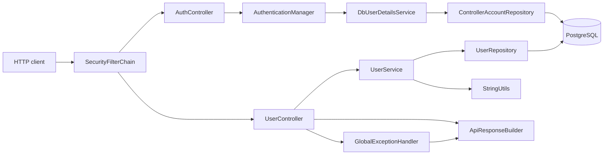

# db-backend

Spring Boot backend for donation-management, documented strictly from committed git history in `HEAD`.

## Overview

This service is a small layered backend that exposes CRUD endpoints for `User` and defines additional domain models for events, offerings, receipts, transactions, and payment modes. It also secures the API behind a session-cookie authentication subsystem for staff `ControllerAccount` logins. The committed code uses Spring Boot 4.0.6, Java 17, Spring Web, Spring Security, Spring Data JDBC, Spring Validation, and PostgreSQL.

## Quick Start

The committed runtime configuration expects database settings from a local `.env` file and runs the app on port `8084`.

```bash
./scripts/run-local.sh
```

If you want to run the app manually, export the required database variables first and then start Maven:

```bash
./mvnw spring-boot:run
```

Run the committed smoke test with:

```bash
./mvnw test
```

## Architecture



## Documentation Index

- [Architecture](architecture.md)
- [Modules](modules.md)
- [API Reference](api-reference.md)
- [Data Model](data-model.md)
- [State Management](state-management.md)
- [Error Handling](error-handling.md)
- [Security](security.md)
- [Testing](testing.md)
- [Build and Deploy](build-and-deploy.md)
- [Conventions](conventions.md)
- [Commit History](commit-history.md)
- [Structure](structure.md)
- [Dependencies](dependencies.md)
- [Glossary](glossary.md)

## Notes

- No Dockerfile, docker-compose file, or CI workflow is present in committed history.
- No frontend state store or migration scripts are present in this repository history. A session-cookie auth subsystem (`AuthController`, `SecurityConfig`, `DbUserDetailsService`, `ControllerAccount`) now secures the backend; see [Security](security.md) for details.