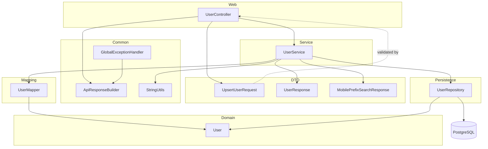

# Architecture

## Architectural Style

The committed backend is a small layered monolith:

- Web layer: `UserController`
- Service layer: `UserService`
- DTO layer: `UpsertUserRequest`, `UserResponse`, `MobilePrefixSearchResponse`
- Mapping layer: `UserMapper`
- Shared utilities: `ApiResponseBuilder`, `StringUtils`
- Error boundary: `GlobalExceptionHandler`, `ResourceNotFoundException`
- Persistence abstraction: `UserRepository`
- Domain model: Spring Data JDBC entities under `model`
- Bootstrapping and configuration: `DbBackendApplication` and `application.yml`

Request flow in the workspace is:

1. HTTP request reaches `UserController`.
2. Bean Validation runs on `UpsertUserRequest` bodies annotated with `@Valid`.
3. The controller delegates to `UserService`, which works with entities internally.
4. `UserMapper` converts between request/response DTOs and `User` entities.
5. `UserService` calls `UserRepository` for persistence operations.
6. Spring Data JDBC persists or fetches entities from PostgreSQL.
7. Missing users throw `ResourceNotFoundException`; other errors are shaped by `GlobalExceptionHandler` and `ApiResponseBuilder`.

## Layer Diagram

## Design Patterns

- DTO boundary pattern: controllers accept `UpsertUserRequest` and return `UserResponse` or `MobilePrefixSearchResponse`.
- Manual mapper pattern: `UserMapper` converts between DTOs and entities with static methods.
- Repository pattern: `UserRepository` extends `CrudRepository<User, Long>`.
- Service layer pattern: `UserService` encapsulates user CRUD business flow over repository calls.
- Utility class pattern: `ApiResponseBuilder` has a private constructor and only static methods.
- Controller advice: `GlobalExceptionHandler` centralizes not-found, bad-request, validation, and generic exception handling.
- Domain not-found exception: `ResourceNotFoundException` with `forResourceWithId` factory for service-layer 404 signaling.
- Shared string validation: `StringUtils.requireNonBlank` normalizes query parameters in `UserService`.
- Constructor injection: `UserController` receives `UserService` through its constructor.
- Aggregate reference modeling: `Receipt`, `Transaction`, and `TransactionItem` use `AggregateReference` to point at other tables.
- Enum-based domain classification: `OfferingCategory` and `PricingType` encode allowed values.

## Inversion of Control

The code relies on Spring Boot auto-configuration and dependency injection. There is no custom DI container and no manual service locator.

## Cross-Cutting Concerns

- Validation is handled with Jakarta Bean Validation annotations on request DTOs.
- Error shaping is centralized in `GlobalExceptionHandler`, including safe generic 500 messages and SLF4J logging for all handled exception types.
- JDBC trace/debug logging is configured in `application.yml`; application exception logging lives in `GlobalExceptionHandler`.
- No security, CORS, caching, rate limiting, or tracing middleware is present in HEAD.

## Backend Deep Dive

The backend uses a dedicated service layer for user flows with a DTO boundary at the controller. `UserController` accepts `UpsertUserRequest` and returns response DTOs; `UserService` orchestrates persistence through `UserMapper` and `UserRepository`. Mobile typeahead returns a `MobilePrefixSearchResponse` wrapper; exact-mobile lookup returns `UserResponse` objects for disambiguation when multiple users share a number.

There are no scheduled jobs, async message consumers, or event publishers in committed history.

## Frontend Architecture

Not found in committed history for this repository.