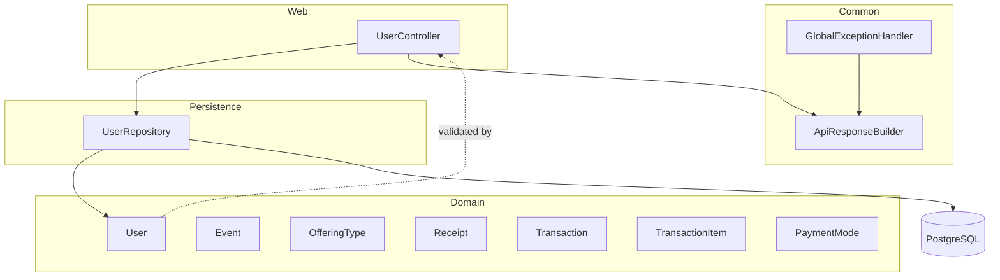

# Architecture

## Architectural Style

The committed backend is a small layered monolith:

- Web layer: `UserController`
- Shared response helpers: `ApiResponseBuilder`
- Error boundary: `GlobalExceptionHandler`
- Persistence abstraction: `UserRepository`
- Domain model: Spring Data JDBC entities under `model`
- Bootstrapping and configuration: `DbBackendApplication` and `application.yml`

Request flow in HEAD is:

1. HTTP request reaches `UserController`.
2. Bean Validation runs on request bodies annotated with `@Valid`.
3. The controller calls `UserRepository`.
4. Spring Data JDBC persists or fetches entities from PostgreSQL.
5. Errors are shaped by `ApiResponseBuilder` and `GlobalExceptionHandler`.

## Layer Diagram

## Design Patterns

- Repository pattern: `UserRepository` extends `CrudRepository<User, Long>`.
- Utility class pattern: `ApiResponseBuilder` has a private constructor and only static methods.
- Controller advice: `GlobalExceptionHandler` centralizes validation and generic exception handling.
- Constructor injection: `UserController` receives `UserRepository` through its constructor.
- Aggregate reference modeling: `Receipt`, `Transaction`, and `TransactionItem` use `AggregateReference` to point at other tables.
- Enum-based domain classification: `OfferingCategory` and `PricingType` encode allowed values.

## Inversion of Control

The code relies on Spring Boot auto-configuration and dependency injection. There is no custom DI container, no manual service locator, and no explicit `@Service` layer in committed history.

## Cross-Cutting Concerns

- Validation is handled with Jakarta Bean Validation annotations on request models.
- Error shaping is centralized in `GlobalExceptionHandler`.
- Logging is configured at JDBC trace/debug levels in `application.yml`.
- No security, CORS, caching, rate limiting, or tracing middleware is present in HEAD.

## Backend Deep Dive

The backend has no separate service layer. `UserController` performs create/read/update/delete logic directly against the repository. That makes the request lifecycle short and easy to follow, but it also means business rules are concentrated in the controller rather than split into services.

There are no scheduled jobs, async message consumers, or event publishers in committed history.

## Frontend Architecture

Not found in committed history for this repository.