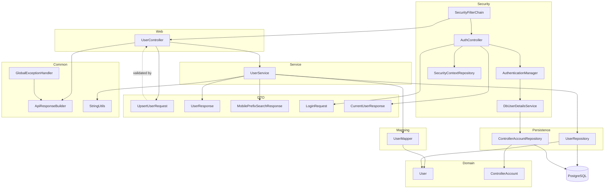

# Architecture

## Architectural Style

The committed backend is a small layered monolith:

- Security layer: `SecurityConfig` (filter chain, `AuthenticationManager`, `PasswordEncoder`), `DbUserDetailsService`
- Web layer: `UserController`, `AuthController`
- Service layer: `UserService`
- DTO layer: `UpsertUserRequest`, `UserResponse`, `MobilePrefixSearchResponse`, `LoginRequest`, `CurrentUserResponse`
- Mapping layer: `UserMapper`
- Shared utilities: `ApiResponseBuilder`, `StringUtils`
- Error boundary: `GlobalExceptionHandler`, `ResourceNotFoundException`
- Persistence abstraction: `UserRepository`, `ControllerAccountRepository`
- Domain model: Spring Data JDBC entities under `model`, including `ControllerAccount` (implements `UserDetails`)
- Bootstrapping and configuration: `DbBackendApplication` and `application.yml`

Request flow in the workspace is:

1. Every HTTP request first passes through the Spring Security filter chain defined in `SecurityConfig`. `POST /api/auth/login` is `permitAll()`; every other request must carry a valid session (`JSESSIONID`) or is rejected with `401` by the `HttpStatusEntryPoint` before reaching a controller.
2. For `/api/auth/login`, `AuthController` authenticates credentials through `AuthenticationManager`, which uses `DbUserDetailsService` to load a `ControllerAccount` and the `BCryptPasswordEncoder` to verify the password; on success the `Authentication` is stored via `SecurityContextRepository` and the session cookie is set on the response.
3. For authenticated requests, `UserController` receives the HTTP request.
4. Bean Validation runs on `UpsertUserRequest` bodies annotated with `@Valid`.
5. The controller delegates to `UserService`, which works with entities internally.
6. `UserMapper` converts between request/response DTOs and `User` entities.
7. `UserService` calls `UserRepository` for persistence operations.
8. Spring Data JDBC persists or fetches entities from PostgreSQL.
9. Missing users throw `ResourceNotFoundException`; other errors, including `AuthenticationException`, are shaped by `GlobalExceptionHandler` and `ApiResponseBuilder`.

## Layer Diagram

## Design Patterns

- Filter chain / gatekeeper pattern: `SecurityConfig` defines a single `SecurityFilterChain` that authorizes every request before it reaches a controller, with `HttpStatusEntryPoint` as the unauthenticated fallback.
- UserDetails-as-entity pattern: `ControllerAccount` implements `UserDetails` directly rather than wrapping a separate principal class.
- DTO boundary pattern: controllers accept `UpsertUserRequest` and return `UserResponse` or `MobilePrefixSearchResponse`.
- Manual mapper pattern: `UserMapper` converts between DTOs and entities with static methods.
- Repository pattern: `UserRepository` extends `CrudRepository<User, Long>`.
- Service layer pattern: `UserService` encapsulates user CRUD business flow over repository calls.
- Utility class pattern: `ApiResponseBuilder` has a private constructor and only static methods.
- Controller advice: `GlobalExceptionHandler` centralizes not-found, bad-request, validation, and generic exception handling.
- Domain not-found exception: `ResourceNotFoundException` with `forResourceWithId` factory for service-layer 404 signaling.
- Shared string validation: `StringUtils.requireNonBlank` normalizes query parameters in `UserService`.
- Constructor injection: `UserController` receives `UserService` through its constructor.
- Aggregate reference modeling: `Receipt`, `Transaction`, and `TransactionItem` use `AggregateReference` to point at other tables.
- Enum-based domain classification: `OfferingCategory` and `PricingType` encode allowed values.

## Inversion of Control

The code relies on Spring Boot auto-configuration and dependency injection. There is no custom DI container and no manual service locator.

## Cross-Cutting Concerns

- Validation is handled with Jakarta Bean Validation annotations on request DTOs.
- Error shaping is centralized in `GlobalExceptionHandler`, including safe generic 500 messages and SLF4J logging for all handled exception types.
- JDBC trace/debug logging is configured in `application.yml`; application exception logging lives in `GlobalExceptionHandler`.
- Session-cookie authentication is enforced globally by `SecurityConfig`'s `SecurityFilterChain`; there is no per-role method security, CORS configuration, caching, rate limiting, or tracing middleware in HEAD.

## Backend Deep Dive

The backend uses a dedicated service layer for user flows with a DTO boundary at the controller. `UserController` accepts `UpsertUserRequest` and returns response DTOs; `UserService` orchestrates persistence through `UserMapper` and `UserRepository`. Mobile typeahead returns a `MobilePrefixSearchResponse` wrapper; exact-mobile lookup returns `UserResponse` objects for disambiguation when multiple users share a number.

`AuthController` handles staff/controller login separately from the `User` (donor) domain: it authenticates against `ControllerAccount` rows in the `controllers` table via `DbUserDetailsService`, and every `/api/users` request now depends on the session that `AuthController` establishes.

There are no scheduled jobs, async message consumers, or event publishers in committed history.

## Frontend Architecture

Not found in committed history for this repository.