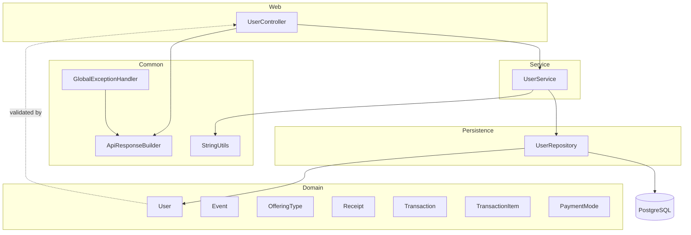

# Architecture

## Architectural Style

The committed backend is a small layered monolith:

- Web layer: `UserController`
- Service layer: `UserService`
- Shared utilities: `ApiResponseBuilder`, `StringUtils`
- Error boundary: `GlobalExceptionHandler`
- Persistence abstraction: `UserRepository`
- Domain model: Spring Data JDBC entities under `model`
- Bootstrapping and configuration: `DbBackendApplication` and `application.yml`

Request flow in HEAD is:

1. HTTP request reaches `UserController`.
2. Bean Validation runs on request bodies annotated with `@Valid`.
3. The controller delegates CRUD logic to `UserService`.
4. `UserService` calls `UserRepository` for persistence operations.
5. Spring Data JDBC persists or fetches entities from PostgreSQL.
6. Errors are shaped by `ApiResponseBuilder` and `GlobalExceptionHandler`.

## Layer Diagram

## Design Patterns

- Repository pattern: `UserRepository` extends `CrudRepository<User, Long>`.
- Service layer pattern: `UserService` encapsulates user CRUD business flow over repository calls.
- Utility class pattern: `ApiResponseBuilder` has a private constructor and only static methods.
- Controller advice: `GlobalExceptionHandler` centralizes bad-request, validation, and generic exception handling.
- Shared string validation: `StringUtils.requireNonBlank` normalizes query parameters in `UserService`.
- Constructor injection: `UserController` receives `UserService` through its constructor.
- Aggregate reference modeling: `Receipt`, `Transaction`, and `TransactionItem` use `AggregateReference` to point at other tables.
- Enum-based domain classification: `OfferingCategory` and `PricingType` encode allowed values.

## Inversion of Control

The code relies on Spring Boot auto-configuration and dependency injection. There is no custom DI container and no manual service locator.

## Cross-Cutting Concerns

- Validation is handled with Jakarta Bean Validation annotations on request models.
- Error shaping is centralized in `GlobalExceptionHandler`.
- Logging is configured at JDBC trace/debug levels in `application.yml`.
- No security, CORS, caching, rate limiting, or tracing middleware is present in HEAD.

## Backend Deep Dive

The backend uses a dedicated service layer for user flows. `UserController` handles HTTP concerns and delegates CRUD plus mobile search/filter behavior to `UserService`, while persistence remains in `UserRepository`. Mobile typeahead uses a dedicated prefix search endpoint that returns distinct mobile numbers; exact-mobile lookup returns full `User` entities for disambiguation when multiple users share a number.

There are no scheduled jobs, async message consumers, or event publishers in committed history.

## Frontend Architecture

Not found in committed history for this repository.